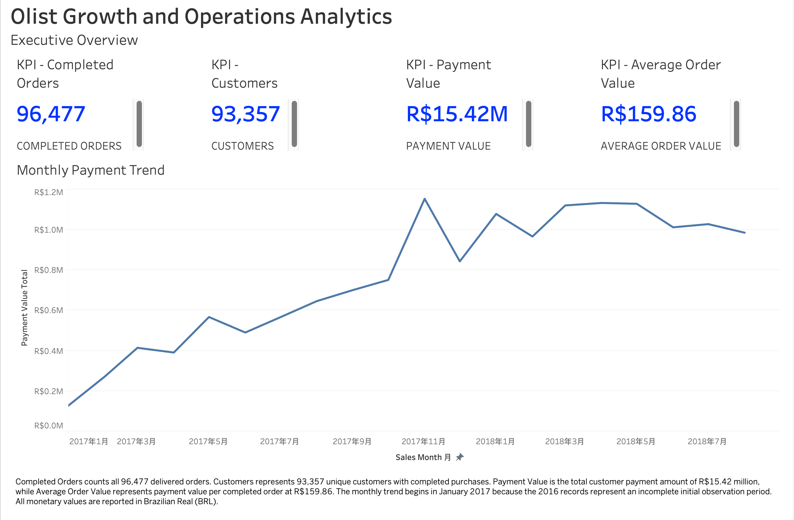
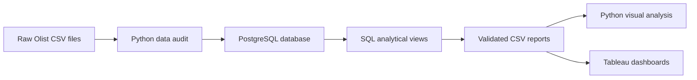
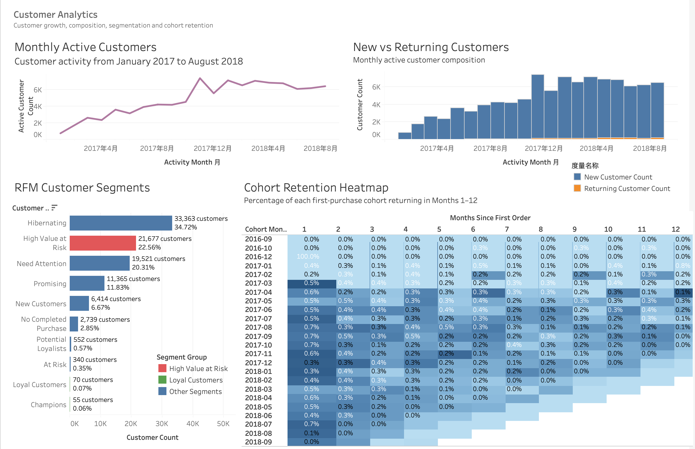
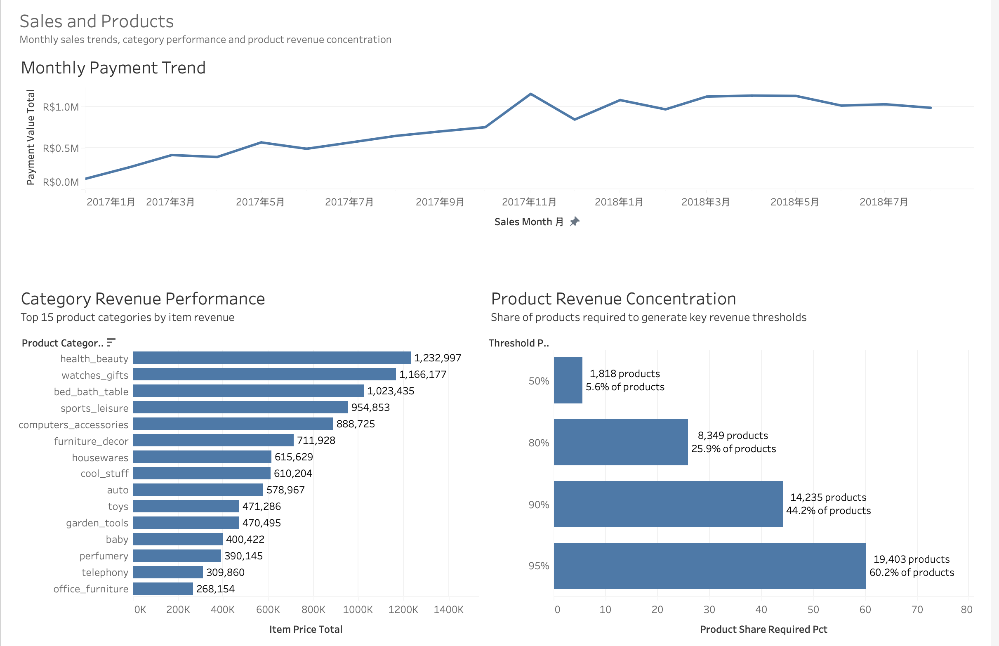
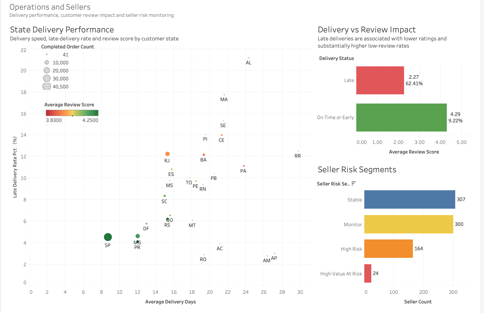

# Olist Growth and Operations Analytics

An end-to-end data analytics portfolio project examining customer growth, sales performance, product concentration, delivery quality, and seller risk in the Brazilian Olist e-commerce marketplace.

The project combines Python, PostgreSQL, SQL, Jupyter Notebook, and Tableau Public to transform raw marketplace data into validated analytical datasets, business insights, and interactive dashboards.

[View the interactive Tableau dashboard](Phttps://public.tableau.com/views/OlistGrowthandOperationsAnalytics/OperationsandSellersASTE_) · [Dashboard guide](docs/dashboard_guide.md) · [Download the Tableau workbook](dashboard/olist_growth_operation_dashboard.twbx)



## Project Objectives

This project was designed to answer five business questions:

1. How did completed orders, customers, and payment value change over time?
2. How effectively did Olist acquire and retain customers?
3. Which categories and products generated the most revenue?
4. How did delivery performance affect customer reviews?
5. Which sellers required operational monitoring or intervention?

## Analytical Workflow



The workflow separates data validation, modelling, business analysis, and presentation. PostgreSQL provides reusable analytical views, while Python and Tableau consume validated report outputs.

## Key Results

### Marketplace overview

| Metric                             |          Result |
| ---------------------------------- | --------------: |
| Completed orders                   |          96,477 |
| Customers with completed purchases |          93,357 |
| Total payment value                | R$15.42 million |
| Average order value                |        R$159.86 |
| Peak sales month                   |   November 2017 |
| Peak monthly completed orders      |           7,289 |
| Peak monthly payment value         |  R$1.15 million |

The main analysis period runs from January 2017 to August 2018 because the available 2016 records represent an incomplete initial observation period.

### Customer growth and retention

* Monthly active customers peaked at approximately 7,430 in November 2017.
* Most monthly activity came from newly acquired customers rather than returning customers.
* Weighted Month-1 cohort retention was approximately 0.48%.
* The largest RFM segment was Hibernating, containing 33,363 customers, or 34.72%.
* High Value at Risk contained 21,677 customers, or 22.56%.
* Need Attention contained 19,521 customers, or 20.31%.

The results indicate strong customer acquisition but limited repeat-purchase behaviour, creating a clear retention opportunity.

### Sales and product performance

The leading product categories by item revenue were:

1. health_beauty
2. watches_gifts
3. bed_bath_table
4. sports_leisure
5. computers_accessories

Product revenue was concentrated, but not limited to a very small catalogue:

| Revenue threshold | Products required | Share of products |
| ----------------- | ----------------: | ----------------: |
| 50%               |             1,818 |              5.6% |
| 80%               |             8,349 |             25.9% |
| 90%               |            14,235 |             44.2% |
| 95%               |            19,403 |             60.2% |

### Delivery and customer reviews

| Delivery status  | Orders | Average review | Low-review rate |
| ---------------- | -----: | -------------: | --------------: |
| Late             |  6,509 |           2.27 |          62.41% |
| On time or early | 88,587 |           4.29 |           9.22% |

Late deliveries represented 6.84% of valid delivery orders. Their substantially lower average rating and higher low-review rate demonstrate a strong relationship between delivery reliability and customer satisfaction.

### Seller risk

A rule-based operational segmentation classified 795 eligible sellers:

| Seller risk segment | Sellers |
| ------------------- | ------: |
| Stable              |     307 |
| Monitor             |     300 |
| High Risk           |     164 |
| High-Value At Risk  |      24 |

The High-Value At Risk group represents the highest intervention priority because it combines meaningful commercial value with weak delivery or review performance.

## Tableau Dashboards

### Executive Overview

Summarises completed orders, customers, payment value, average order value, and monthly performance.


### Customer Analytics

Combines monthly active customers, new-versus-returning composition, RFM segmentation, and cohort retention.



### Sales and Products

Presents the monthly payment trend, leading categories, and product revenue concentration.



### Operations and Sellers

Compares state-level delivery performance, delivery-related review outcomes, and seller risk segments.



## Data Quality and Validation

The project includes checks for:

* Primary-key uniqueness
* Foreign-key coverage
* Missing values
* Invalid numeric values
* Timestamp consistency
* Category translations
* Geographic ZIP-code coverage
* Business-rule compliance
* Analytical-view grain and duplication
* Reconciliation of order and payment totals

Validation outputs are stored in the `reports/` directory. The final analytical views reconcile to 96,477 completed orders without duplicate reporting grains.

## Technology Stack

* **Python:** pandas, NumPy, Matplotlib and Seaborn
* **Database:** PostgreSQL
* **SQL:** data definition, constraints, indexes, analytical views, CTEs, window functions and validation queries
* **Notebook:** JupyterLab
* **Business intelligence:** Tableau Public
* **Version control:** Git and GitHub

## Repository Structure

```text
olist-growth-operations-analytics/
├── dashboard/
│   └── olist_growth_operation_dashboard.twbx
├── docs/
│   ├── analytics_data_model.md
│   ├── customer_analysis.md
│   ├── dashboard_guide.md
│   ├── data_cleaning.md
│   ├── data_model.md
│   ├── database_setup.md
│   ├── sales_product_analysis.md
│   ├── seller_delivery_operations_analysis.md
│   └── visual_analysis.md
├── notebooks/
│   ├── 01_data_inventory.ipynb
│   ├── 02_schema_and_key_checks.ipynb
│   ├── 03_data_cleaning.ipynb
│   └── 10_portfolio_visual_analysis.ipynb
├── reports/
│   └── validated analytical CSV outputs
├── sql/
│   ├── 01_create_tables.sql
│   ├── 02_load_data.sql
│   ├── ...
│   └── 16_operations_business_analysis.sql
└── visuals/
    ├── analytical PNG charts
    └── Tableau dashboard screenshots
```

## Reproducing the Analysis

1. Download the [Brazilian E-Commerce Public Dataset by Olist](https://www.kaggle.com/datasets/olistbr/brazilian-ecommerce).
2. Review the raw-data inventory and schema checks in `notebooks/`.
3. Follow [the database setup guide](docs/database_setup.md).
4. Execute the SQL scripts in numerical order from `sql/01_create_tables.sql` to `sql/16_operations_business_analysis.sql`.
5. Review the validation outputs and business reports in `reports/`.
6. Run `notebooks/10_portfolio_visual_analysis.ipynb` to reproduce the Python charts.
7. Open `dashboard/olist_growth_operation_dashboard.twbx` or use the Tableau Public link to explore the interactive dashboards.

## Documentation

* [Database setup](docs/database_setup.md)
* [Data model](docs/data_model.md)
* [Data cleaning](docs/data_cleaning.md)
* [Analytics data model](docs/analytics_data_model.md)
* [Customer analysis](docs/customer_analysis.md)
* [Sales and product analysis](docs/sales_product_analysis.md)
* [Seller, delivery and operations analysis](docs/seller_delivery_operations_analysis.md)
* [Python visual analysis](docs/visual_analysis.md)
* [Tableau dashboard guide](docs/dashboard_guide.md)
- [Portfolio and CV summary](docs/portfolio_summary.md)

## Business Recommendations

1. Build targeted reactivation campaigns for Hibernating and Need Attention customers.
2. Protect High Value at Risk customers through personalised retention offers.
3. Investigate high-delay states and improve carrier or fulfilment capacity.
4. Prioritise seller intervention for High-Value At Risk and High Risk sellers.
5. Maintain investment in leading categories while monitoring product revenue concentration.
6. Treat delivery reliability as a customer-experience KPI because late delivery is strongly associated with poor reviews.

## Scope and Limitations

* The source data is a public historical marketplace dataset rather than a live production system.
* The available observation window limits long-term retention analysis.
* The analysis identifies associations and operational patterns but does not establish causal effects.
* Seller risk segments are rule-based and should be validated before production use.
* Monetary values are reported in Brazilian Real (BRL).
